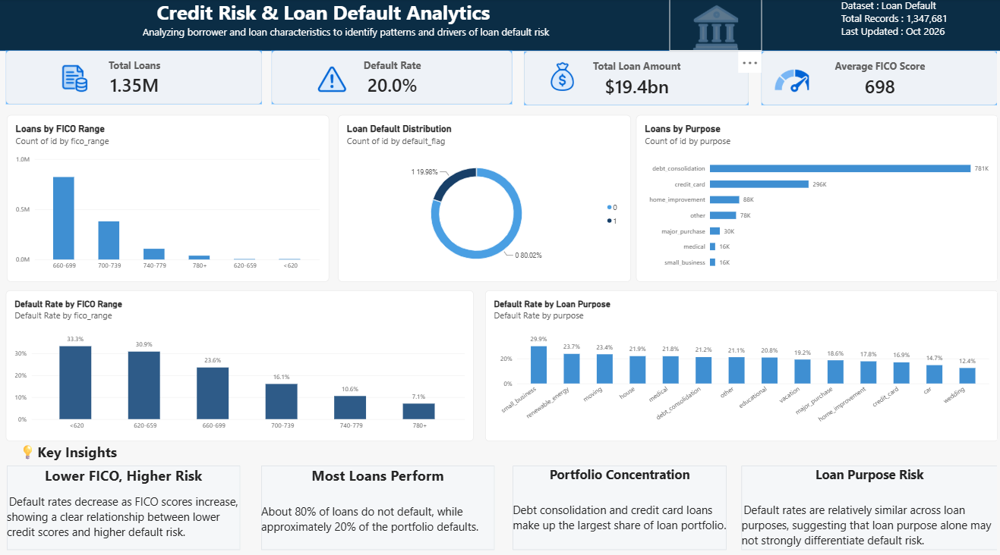

# Credit Risk & Loan Default Analytics

A Power BI dashboard analyzing borrower and loan characteristics to identify patterns and drivers of loan default risk.

## Project Overview

This project analyzes loan and borrower data to better understand credit risk and the factors associated with loan defaults. I cleaned and explored the dataset using Python and built an interactive Power BI dashboard to summarize the portfolio and highlight important risk patterns.

The analysis focuses on FICO scores, loan purpose, loan amounts, and default behavior.

## Tools Used

- Python
- Pandas
- Jupyter Notebook
- Power BI
- DAX

## Data Preparation

Python and Pandas were used to explore and prepare the dataset before visualization. The data preparation process included:

- Inspecting the dataset structure and data types
- Checking for missing values and duplicates
- Cleaning and preparing fields for analysis
- Creating useful borrower and loan groupings
- Preparing the cleaned data for Power BI

The data exploration and preparation process can be viewed in `01_data_exploration.ipynb`.

## Dashboard KPIs

The dashboard summarizes more than 1.3 million loan records and includes:

- Total Loans: 1.35M
- Default Rate: 20.0%
- Total Loan Amount: $19.4B
- Average FICO Score: 698

## Key Insights

- Default rates decrease as FICO scores increase, showing a clear relationship between lower credit scores and higher default risk.
- Approximately 80% of loans do not default, while about 20% of the portfolio defaults.
- Debt consolidation and credit card loans make up the largest share of the loan portfolio.
- Default rates across loan purposes are relatively similar, suggesting that loan purpose alone may not strongly differentiate default risk.

## Dashboard

The Power BI dashboard includes visual analysis of:

- Loans by FICO range
- Default rate by FICO range
- Loan default distribution
- Loans by purpose
- Default rate by loan purpose

## Repository Contents

- `01_data_exploration.ipynb` - Python data exploration and preparation
- `credit-risk-loan-default-dashboard.png` - Final Power BI dashboard
- `README.md` - Project documentation

## Author

Precious Ihedoro
